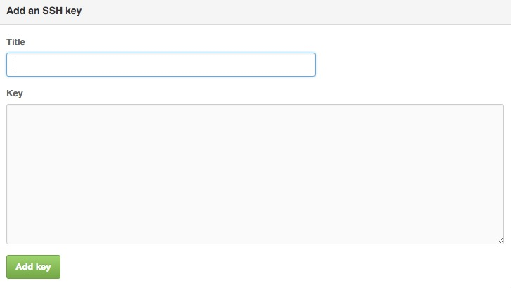

# Mac配置命令行访问github.com

## 背景
github.com 提供 Web 页面和 Gitub Desktop 两种方式来与 github.com 交互，但是自己有个小习惯，双手沾键盘之后就不太喜欢再伸手碰鼠标或者 Mac 的触摸板，简直就是“键盘侠”。

另外，整个 OMOOC2py 学习期间，需要经常将可运行的代码同步到 github.com 的 repo. 上，还需要坚持写每日反省通过 github.com 同步到 gitbooks 立即编译发布。

## 生成 public key
为了能够从命令行快速方便地访问存放在 github.com 上的 repo.，需要先与 github.com 建立 SSH 互信。这样，每次使用 git 命令操作 repo. 的时候就不需要输入密码验证账户身份。
生成 public key 的方法很简单，打开终端，输入以下命令：

    cd ~./ssh
    ssh-keygen -t rsa

执行第二个命令后，屏幕会打印一系列提示信息，需要用户输入来确认，直接一路回车即可。待对 SSH 互信有更深入的了解之后再做更详细的研究。 命令执行结束之后执行`ls -al`命令，可以看到这两个文件：`id_rsa`和`id_rsa.pub`。
       
## 添加 public key 到 SSH keys list
接下来要做的是将 publick key 的内容添加到 github.com 账户中。github.com 作为服务端，电脑上的终端作为客户端，两者通信时靠这个 public key 就可以校验对方身份。
首先需要登录 github 账户，打开个人设置页面的 [SSH keys](https://github.com/settings/ssh) 配置项。将`id_rsa.pub`文件中的内容全部复制后，点击页面上的`Add SSH key`。Title随意，也可以不填；key 的文本框中就把刚才赋值的`id_rsa.pub`的内容粘贴进去，点击保存就可以进入下一步啦！

## 测试连接
上述两步做完之后就可以在命令行做连通测试啦！

    ssh -T git@github.com
    
如果没有问题的话，你得到的将是 github.com 返回给你的一串欢迎信息。

`Hi faketooth! You've successfully authenticated, but GitHub does not provide shell access.`

如果得到的是`Permission denied (publickey).`等其他信息，说明互信没有建立成功，可以参考一下 github.com 给出的官方指导 [Generating SSH keys
](https://help.github.com/articles/generating-ssh-keys/) 和 [common SSH Problems](https://help.github.com/categories/ssh/) 。