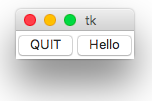

# A Simple Hello World Program

模仿是简单也是最好的学习手段之一。初级知识需要对高级知识深入了解，才能深入了解。所以，我们需要先通过模仿来上路。

本周任务是将上周的简易日记系统 GUI 化，`Python`的`TKinter`未曾接触过，因此决定先从官方文档入手学习一下。

```
from Tkinter import *

class Application(Frame):
	def say_hi(self):
		print "hi there, everyone!"
	
	def createWidgets(self):
		self.QUIT = Button(self)
		self.QUIT["text"] = "QUIT"
		self.QUIT["fg"] = 'red'
		self.QUIT["command"] = self.quit
		
		self.QUIT.pack({"side": "left"})
		
		self.hi_there = Button(self)
		self.hi_there["text"] = "Hello",
		self.hi_there["command"] = self.say_hi
		
		self.hi_there.pack({"side": "left"})
		
	def __init__(self, master=None):
			Frame.__init__(self, master)
			self.pack()
			self.createWidgets()

root = Tk()
app = Application(master=root)
app.mainloop()
root.destroy() 
```
运行效果如下(***好吧，这个运行结果是错的，因为犯了一个鱼唇的错误导致控件没有绘制出来，右侧的图才是对的***)：




但在鼠标关闭窗口的时候，shell中可以看到以下报错信息：

```
Traceback (most recent call last):
  File "ASimpleHelloWorldProgram.py", line 31, in <module>
    root.destroy() 
  File "/Library/Frameworks/Python.framework/Versions/2.7/lib/python2.7/lib-tk/Tkinter.py", line 1859, in destroy
    self.tk.call('destroy', self._w)
_tkinter.TclError: can't invoke "destroy" command:  application has been destroyed
```
看错误信息的意思是调用`root.destroy()`方法的时候，`application`已经被销毁了。注释掉那行代码之后，再次执行不再报错。暂时作为 bug 提交一个 [issue](https://github.com/faketooth/OMOOC2py/issues/3) 。

## 代码分析
