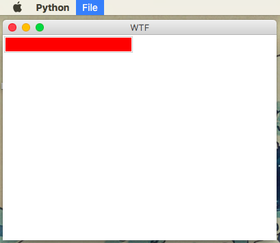
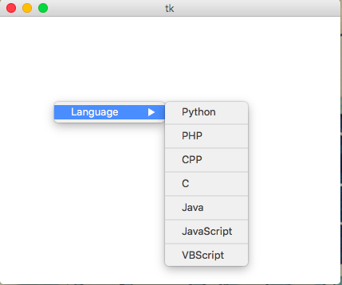
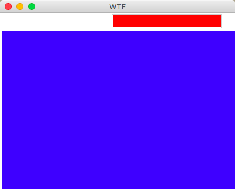
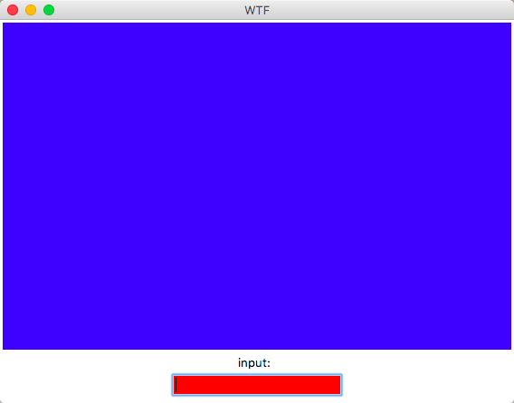
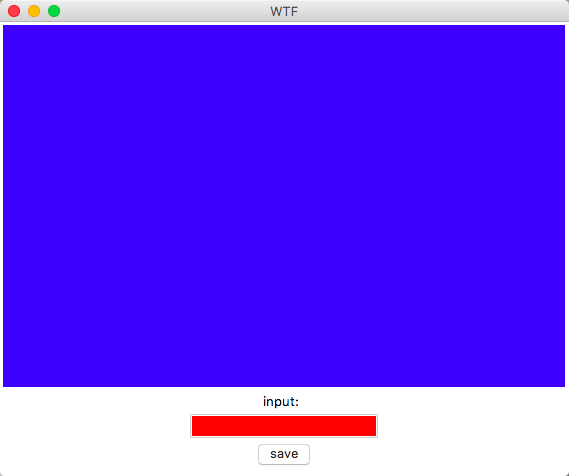
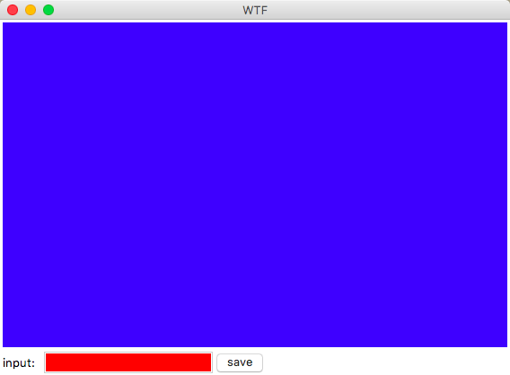

# 迭代记录
---------------------------------------------------

## 创建文本框控件

迭代代码

```
from Tkinter import *

class Application(Frame):
	
	def createWidgets(self):
			text = Entry(self, background = 'red')
			text.pack()
			
		
	def __init__(self, master=None):
			Frame.__init__(self, master)
			self.pack()
			self.createWidgets()

app = Application()
app.mainloop()
```
效果：


### 参考资料：
1. [Python2.7.3 Tkinter Entry(文本框) 说明](http://www.cnblogs.com/onlyfu/archive/2013/03/07/2947473.html)


## 添加菜单

迭代代码

```
from Tkinter import *

class Application(Frame):
	
	def createWidgets(self):
			text = Entry(self, background = 'red')
			text.pack()
			
			menu = Menu(self)
			menu.add_command(label="Hello")
		
	def __init__(self, master=None):
			Frame.__init__(self, master)
			self.pack()
			self.createWidgets()

app = Application()
app.mainloop()
```
效果和上图相同，定位后发现是因为`menu`没有调用`pack()`方法。
> 所有的Tkinter组件都包含专用的几何管理方法，这些方法是用来组织和管理整个父配件区中子配件的布局的。Tkinter提供了截然不同的三种几何管理类：pack、grid和place。
> pack几何管理采用块的方式组织配件，在快速生成界面设计中广泛采用，若干组件简单的布局，采用pack的代码量最少。pack几何管理程序根据组件创建生成的顺序将组件添加到父组件中去。通过设置相同的锚点（anchor）可以将一组配件紧挨一个地方放置，如果不指定任何选项，默认在父窗体中自顶向下添加组件。

添加之后出现新的问题：

```
Traceback (most recent call last):
  File "main.py", line 24, in <module>
    app = Application()
  File "main.py", line 22, in __init__
    self.createWidgets()
  File "main.py", line 17, in createWidgets
    menu.pack()
  File "/Library/Frameworks/Python.framework/Versions/2.7/lib/python2.7/lib-tk/Tkinter.py", line 1940, in pack_configure
    + self._options(cnf, kw))
_tkinter.TclError: can't pack ".4330939672.4331056088": it's a top-level window
```
也就是说，`Menu`不能用`pack()`来管理。开ISSUE跟踪分析：[issue4](https://github.com/faketooth/OMOOC2py/issues/4)

`Tkinter`中提供的菜单有三种形式：`Toplevel`，`Pulldown`，`Popup`。多方查找相关Demo，发现在`Mac`上无法单独展现`Toplevel`类型的菜单项，必须与下拉菜单配合才行；而`Popup`的Demo在`Mac`上的执行结果与Demo注释不符，`<Button-3>`被识别为鼠标中键消息，而非右键。经测试，`Mac`上的鼠标右键应为`<Buttion-2>`。

下拉菜单的效果：



关键代码为:

```
menubar = Menu(root)
file = Menu(menubar)
file.add_command(label="File", command=self.foo)
file.add_command(label="Quit", command=self.foo)
menubar.add_cascade(label="File", menu=file)
root.config(menu=menubar)
```

弹出菜单执行效果：



关键代码为：

```
menubar.add_cascade(label = 'Language',menu = filemenu)
def popup(event):
    #显示菜单
    menubar.post(event.x_root,event.y_root)
#在这里相应鼠标的右键事件，右击时调用popup,此时与菜单绑定的是root，可以设置为其它的控件，在绑定的控件上右击就可以弹出菜单
root.bind('<Button-2>',popup)
```

### 参考资料
1. [The Tkinter Menu Widget](http://effbot.org/tkinterbook/menu.htm)
2. [The Tkinter Toplevel Widget](http://effbot.org/tkinterbook/toplevel.htm)
3. [Python Tkinter menu bars don't display](http://stackoverflow.com/questions/15373493/python-tkinter-menu-bars-dont-display)
4. [Hello, Tkinter](http://effbot.org/tkinterbook/tkinter-hello-tkinter.htm)
5. [Tk Concepts](http://www.tkdocs.com/tutorial/concepts.html):Window Hierarchy
6. [Python Tkinter Menu使用教程](http://blog.csdn.net/wangyiyan315/article/details/16367551)
7. [Tkinter教程之Menu篇](http://blog.csdn.net/jcodeer/article/details/1811321)
8. [Python之Tkinter布局管理](http://blog.csdn.net/zxia1/article/details/8254092)

## 添加文本框
文本框的目的是展示当前和历史日记内容，禁用其编辑能力，关键代码：

```
text = Text(self, background = 'blue')
text.config(state=DISABLED)
text.pack()
```
效果：



## 再来一个Label

增加标签，提高界面友好度。关键代码：

```
label = Label(self, text='input: ')
label.pack()
```
效果：



## 还需要个按钮
按钮提供保存当前日记的能力，关键代码如下：

```
button = Button(self, text='save')
button.pack()
```
执行效果：



## 调整布局
目前所有控件是按照添加顺序纵向排列，需要调整一下顺序。因此需要调整`Label`，`Entry`，`Button`三个控件的位置，从左到右依次排列。关键代码：

```
label.pack({"side": "left"})
entry.pack({"side": "left"})
button.pack({"side": "left"})
```
效果如下：



还需要进一步微调。