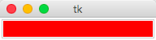

# 迭代记录
---------------------------------------------------

## 1. 创建文本框控件

迭代代码

```
from Tkinter import *

class Application(Frame):
	
	def createWidgets(self):
			text = Entry(self, background = 'red')
			text.pack()
			
		
	def __init__(self, master=None):
			Frame.__init__(self, master)
			self.pack()
			self.createWidgets()

app = Application()
app.mainloop()
```
效果：



## 2. 添加菜单

迭代代码

```
from Tkinter import *

class Application(Frame):
	
	def createWidgets(self):
			text = Entry(self, background = 'red')
			text.pack()
			
			menu = Menu(self)
			menu.add_command(label="Hello")
		
	def __init__(self, master=None):
			Frame.__init__(self, master)
			self.pack()
			self.createWidgets()

app = Application()
app.mainloop()
```
效果：

