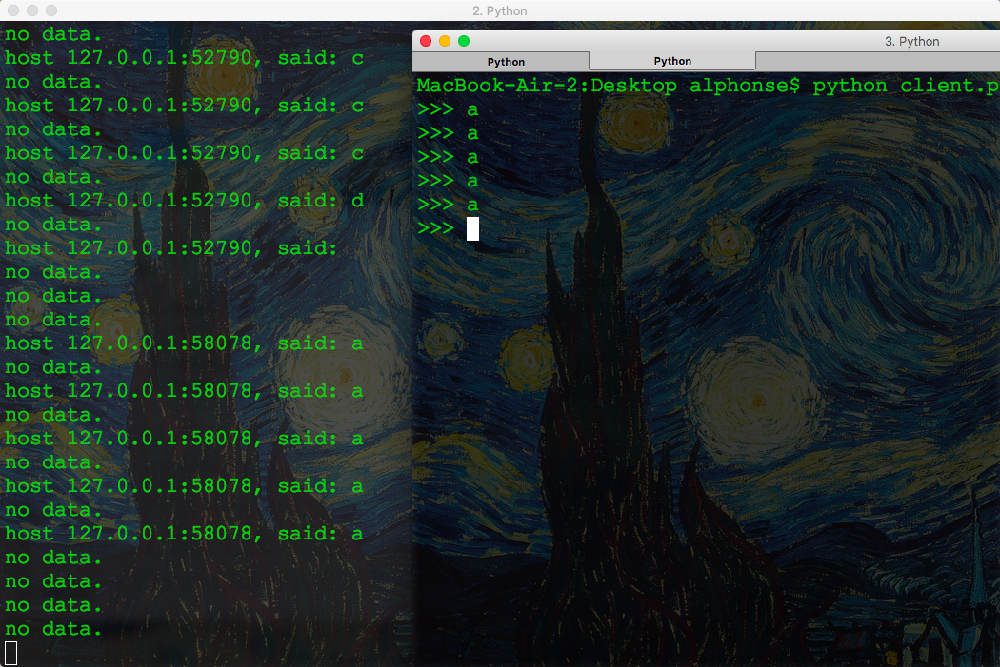

# 基于网络的日志系统

## 1. 原型三问
### 如何进行网络开发
Socket 分为`阻塞性Socket`和`非阻塞性Socket`。客户端的Socket就像是对话中的一个终端，服务端的Socket就像是电话接线板的操作员。而且，Socket是目前位置最受欢迎的`IPC（进程间通信）`形式之一，相遇对其他方案，Socket实现更为容易，也具有跨平台的优势。

客户端Socket的生命过程：创建socket，连接服务器，交换数据，销毁。

```
#create an INET, STREAMing socket
s = socket.socket(
    socket.AF_INET, socket.SOCK_STREAM)
#now connect to the web server on port 80
# - the normal http port
s.connect(("www.mcmillan-inc.com", 80))
```

服务端Socket生命过程：创建socket，绑定ip和端口，监听。

```
#create an INET, STREAMing socket
serversocket = socket.socket(
    socket.AF_INET, socket.SOCK_STREAM)
#bind the socket to a public host,
# and a well-known port
serversocket.bind((socket.gethostname(), 80))
#become a server socket
serversocket.listen(5)
```
注意：

* 使用`hostname`方式可以让服务端的socket对外可访问
* 使用`localhost`或者`127.0.0.1`仅限于本机监听
* 使用`''`则表示在本机任意ip上监听（存在于多网卡的场景）
* 端口号尽量使用四位数字以上
* `listen()`方法中的5的意思是，最多支持5个客户端连接，超过这个上限的客户端连接请求会被拒绝

创建一个`mainloop`，将服务端作为一个简易的`Web Server`。

```
while 1:
    #accept connections from outside
    (clientsocket, address) = serversocket.accept()
    #now do something with the clientsocket
    #in this case, we'll pretend this is a threaded server
    ct = client_thread(clientsocket)
    ct.run()
```
**`Server Socket`**的作用：不发送任何数据，也不接收任何数据，只创建客户端Socket，用于跟对端的客户端Socket通信。服务端处理客户端Socket的方式有三种，`client_thread(clientsocket)`只是伪代码：分配一个线程来处理clientsocket，创建一个子进程来处理clientsocket，使用非阻塞性socket。

当`客户端的clientsocket`和`服务端的clientsocket`建立连接之后，我们需要两个动词来描述它们之间的通信：`send`和`recv`，而其对应的操作也是socket编程的难点部分。我们的职责就是通过`send`和`recv`来操作网络缓存，使用它们来完成消息处理过程。

当`recv`返回0个字节时，表示对端关闭了连接，你再也收不到任何数据。HTTP协议中使用socket作为一次性传递方式：客户端发起一个请求，然后读取回应。

对于一个socket而言，没有EOT（End of Transfer）这种东西。就是说，socket不会跟你说接下来没啥还要读取的了。所以，当一个socket的`send`和`recv`返回0字节之后，这个socket已经`broken`。如果没有，你就会永远卡在`recv`这一步。

所以，使用socket传递消息的时候，要么消息长度固定，要么存在分隔符，要么隐含消息有多长，或者关闭连接来作为结束。

socket在使用结束之后需要调用`close`来显式关闭，虽然Python存在自动回收机制，但依赖这个机制并不是个好习惯。如果对端没有调用`close`来关闭socket，如果使用多线程来处理clientsocket，那么这个线程本质上来说已经僵死，并且也没啥能采取的措施。不要试图杀死一个线程，否则整个进程会被玩坏。


#### 非阻塞性Socket
Python中创建非阻塞性socket，只需在socket创建之后只用之前，调用`socket.setblocking(0)`。但这样的话就需要用`send`、`recv`、`connect`、`accept`，除了各种各样的返回码可以把你逼疯之外，还可以让你app的代码变得庞大，具备各种bug以及搞死CPU的能力。

一次性把事情做对的方法是：用select。

```
ready_to_read, ready_to_write, in_error = \
               select.select(
                  potential_readers,
                  potential_writers,
                  potential_errs,
                  timeout)
```
三个返回值和前三个入参都是list，如果有一个服务端socket，把它放到`potential_readers`中，如果在`ready_to_read`中发现了它，说明可以调用`accept`并`recv`数据了；反之，客户端socket放到`potential_writers`中，并在`ready_to_wirte`中检查。`timeout`则作为超时时间，避免阻塞。


***以上内容全部演绎自官方文档 [Socket Programming HOWTO](https://docs.python.org/2/howto/sockets.html)。***


## 2. 什么是 UDP 协议

UDP 协议是一种简单的不可靠信息传送服务，只管发，不操心对端是否成功接收。缺点是不提供数据包分组、组装和不能对数据包进行排序，但是相对于 TCP 协议，传送过程简单快速（不需要三次握手、错误重传等）。


## 3. 基于 Python 的 UDP 服务端/客户端

服务端代码：

```
# -*- coding: utf-8 -*-

import socket
import select

def main():
	sock = socket.socket(socket.AF_INET, socket.SOCK_DGRAM)
	sock.bind(('', 9527))
	while True:
		reads, wirtes, errs = select.select([sock,],[],[],3)
		if len(reads) != 0:
			data, (host, port) = sock.recvfrom(8192)
			print "host %s:%s, said: %s" % (host, port, data)
		print 'no data.'
		
	sock.close()
	
if __name__ == '__main__':
	main()	
```

客户端代码：

```
# -*- coding: utf-8 -*-

import socket

def main():
	clientSock = socket.socket(socket.AF_INET, socket.SOCK_DGRAM)
	while True:
		input = raw_input(">>> ")
		if input in ['q', 'quit', 'exit']:
			break
		clientSock.sendto(input, ('localhost', 9527))
		
	clientSock.close()
	
if __name__ == '__main__':
	main()
```

测试结果：
