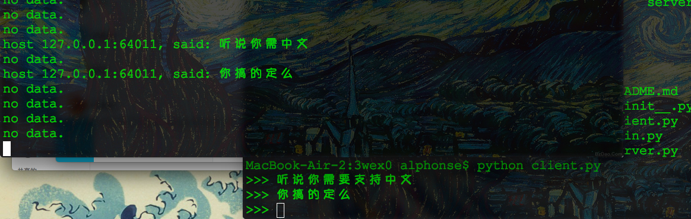
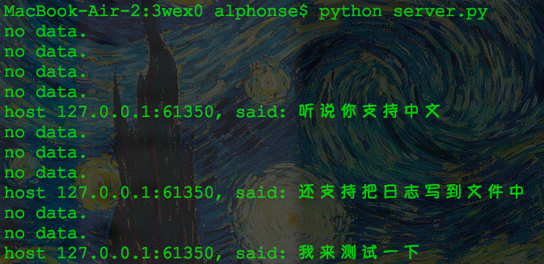
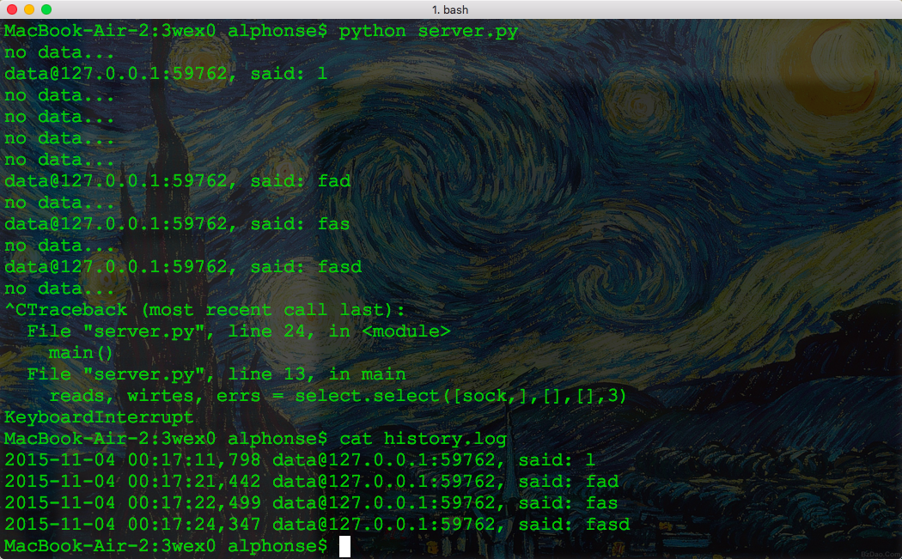
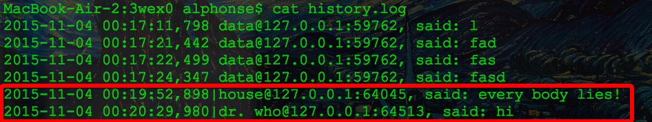
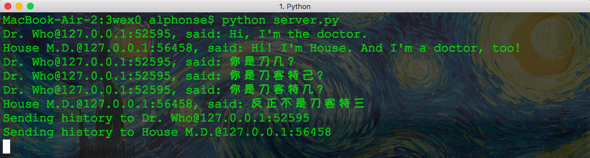
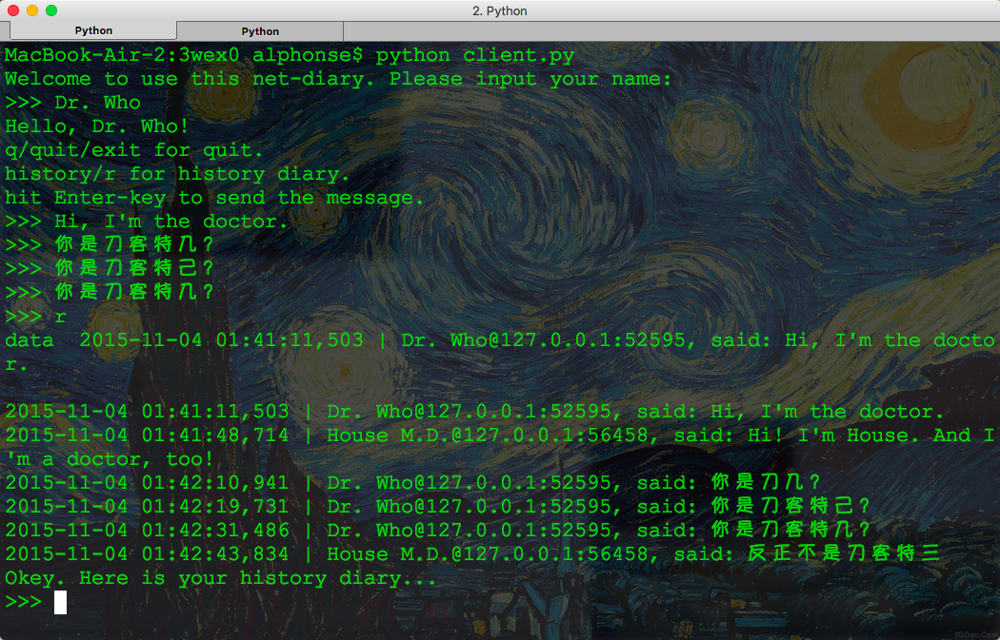
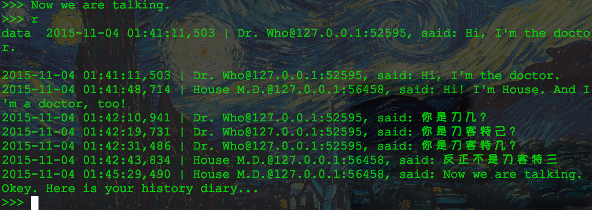

# 芝麻说，要保存消息

* 支持中文推送
	* 基于 CLI，需要特殊处理嘛？
	
* 支持连续发送
	* 已经实现
		* **上图显而易见啊**
* 接收到的消息立即保存
	* 保存为文件？
		* 首选`logging`模块
		
		
		* 内容？
			* ip
			* 端口
			* 用户名？
			* 消息内容
			* 时间戳
			
		* 普通文本文件？
			* 列分隔符文件？
				* 什么字符作为分隔符比较恰当？
					* 好像都不恰当，没有完美方案
			* 定长文件？
				* 按字节存储，不会产生列分隔符冲突
				* 解析、写入费事
		* XML 文件？
			* 写入性能如何？
			* 从`socket data`转为 XML 的元素，额外需要花费多少？
	* 保存到数据库？
		* 外置数据库
			* MySQL？
		* 是否有内置数据库？
			* 果然有SQLite，曰`SQLite3`
* 多客户端
	* 同时、连续发送消息
	
	* 反复获得历史消息
		* 新增获取历史消息的命令接口
		* 是否需要使用 TCP 协议？
		* 是否提供独立的端口用于处理该类请求？
		* 历史消息如何发送？
	
	
	