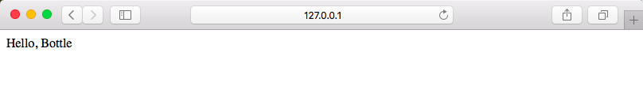
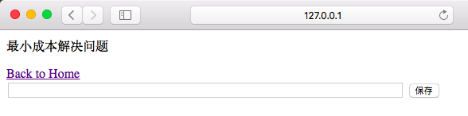
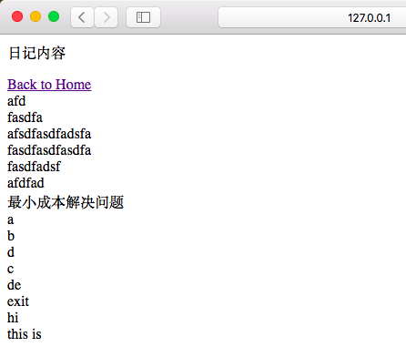
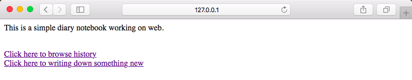

# Web 101 开发记录

因为在上海出差，这一段时间事情比较多，本周作业拖了很久才完成，连公开课都没能完整看完。从某种程度上来说是草草了事，不过还真被`Python`的`Web`开发能力惊艳了一把，不知道`Ruby`的有咩有这种效果。

任务开始的比较晚，在`github`上参考了一下其他同学的情况后，决定实践中学习`bottle`。先用这个[Tutorial: Todo-List Application](http://bottlepy.org/docs/dev/tutorial_app.html) 练习了一下，开始做作业。

## 先来 Hello, Bottle
真是简单到爆。


```
@route('/')
def index():
	return "Hello, Bottle"
```

## 招呼打好之后开始干活


原本想做成类似于在线博客编辑器的那种形式，有标题栏和正文编辑器，但是时间不允许。就直接设计了而一个文本输入框加保存按钮。

输入内容之后点击保存或者直接敲回车，日志成功写入后台文件，未使用数据库。

## 查看历史信息


这个就是逐行打印`diary.txt`文件的内容。

`To-do List Application`的教程中，是在`tpl`文件中，添加`Python`脚本实现的，但是看到@Zoe是`Python`代码中拼接完毕后，返回一个长字符串。

***各有何优劣？***	

## 兼容命令行模式
一按开始的思路是怎么吧3w任务的代码合并到Web服务器中，但按照自己的『目测』，框架中的run()方法实际上也是一个循环体，不可能与上周的循环监听合并。至少以目前自己的能力来说。

一通Google之后发现可以用Python模块来模拟访问Web页面，并填写表单。

代码简单，效果拔群。

```
import requests

def main():
	print "input your diary:"
	while True:
		input = raw_input(">>> ")
		if input in ['q']:
			return
		else:
			write(input)
			
def write(line):
	text = {"newline": line, "save":"save"}
	requests.get('http://localhost:8080/new', params = text)
	
	
if __name__ == '__main__':
	main()
```

## 最终效果



## 体验

1. Python 非常适合快速原型开发
2. 这么多效果拔群的框架，简直可以用Python给自己造各种轮子玩
3. 这段时间一直在考虑为什么到了晚上十点还没开始锻炼，心里就着急
	* 可是如果说到了某个时间点儿还没开始学今天的`Python`，却一点都不着急
	* 考虑过几种可能的原因
		* 体力相对于脑力活动更容易热身和进入状态
			* 如何准备一些方便脑力热身的材料？
			* zhimastar？
			* Learn Python the Hard Way?
			* 靠其他领域的东西来为Python学习进行脑力热身？
		* 还不能像趴下就能做俯卧撑一样，随便可以开始学Python
		* 对`Python`学习存在拖延倾向
			* 这是个非常可怕的信号
	* 综上，需要通过多方面的手段让自己Python起来
4. 好激动，我要用Python去造轮子！