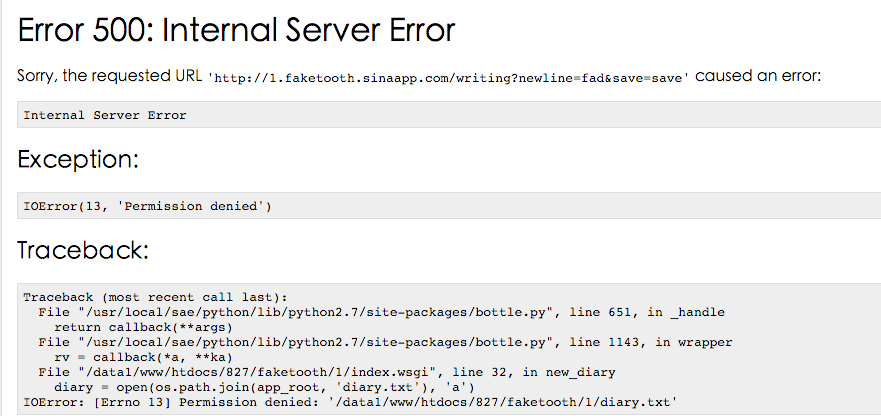

#初步使用SAE && 不支持写文本文件

## 1. 参考资料
* [新浪云 SAE](http://www.sinacloud.com/doc/sae/index.html)
* [新浪云Git代码仓库使用入门](http://bookshadow.com/weblog/2015/09/10/sae-git-introduction/)


## 2. 遭遇的问题
* 无法使用`git`克隆仓库
	* 因为使用微博账号登陆，不知道安全账户以及密码
	* 重新设置账号和密码
	* 根据参考资料，克隆仓库，并测试提交代码成功

* 远程调试困难
	* 搭建本地调试环境
	* `Bottle`已经安装
	* 目测了一把，使用`pip install sae`安装失败
		* 原来正确名称是`sae-python-dev`	
		* `Bottle`可以直接运行脚本，`sae`呢？
			* `dev_server.py index.wsgi`
* 除了首页，`reading`和`new_diary`页面访问报服务器内部错误
	* 应该是`template`文件访问异常
	* 修改代码，使用绝对路径访问

		```
		app_root = os.path.dirname(__file__) 
		template(os.path.join(app_root, 'template', 'reading.tpl'), content=lines)
		```

* 写`diary.txt`时报内部错误
	* 修改`diary.txt`路径，使用绝对路径
		* 无效
		* 而且`reading`页面使用的也是相对路径，访问正常
		* 因此可以推断与绝对路径/相对路径问题无关
	* 页面返回的信息只有`Internal Server Error`
	* 文件权限`644`，有写权限
		* `git`引起的？
			* 搜索发现只有因为文件权限变更，被`git`检测到的问题
			* `git`也不存在设置文件权限的命令
	* 突然想起`bottle`有调试开关
		* 修改代码，打开调试开关
		* 访问页面，得到了详细的错误信息

		* 果然还是权限问题
			* `SAE`不给文件写权限？
				* [`app_root`还真是不给写](http://www.douban.com/group/topic/23810299/)
			* 那咋办？
				* Storage？
				* KVDB？
				* 关键是，谁免费
	* 就是说，想要把提交的日记信息保留下来，需要重构代码
		* 琢磨了一下Storage和KVDB的示例代码
			* Storage [代码](http://www.sinacloud.com/doc/sae/python/storage.html#id5)
			* KVDB [代码](http://www.sinacloud.com/doc/sae/python/kvdb.html#id4)
		* 果断用KVDB先重构一把试试
