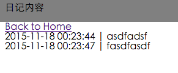
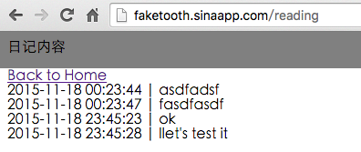

# 支持KVDB，测试CLI

* 参照[官方文档](http://www.sinacloud.com/doc/sae/python/kvdb.html#module-sae.kvdb)，调试`KVDB`
	* 尝试使用时间戳作为`key`
		* 需要将时间戳转为`str`类型
		* 成功插入数据后，准备遍历数据
			* 时间戳时间跨度大，无法良好遍历
	* 放弃使用时间戳作为`key`
	* 使用数字作为key，每增加一条，作为索引递增一下
		* 在`kvdb`中新增一个`key`为`last`的记录
			* 将最后一次的`key`存入`last`中
		* 遍历之前，先从`last`中获取最大的索引值
			* 使用`for`循环遍历所有数据
	* 按照第二次的实现思路，时间戳也可以作为`key`
		* 添加一个`key`名称为`index`的记录
		* `value`为列表，每新增一条日记，`append`一个`str`类型的时间戳到列表中
		* 遍历时，所有日记的`key`值从`index`中获取
	* `value`使用`jason`的话，应该可以存储更丰富的数据，例如`username`，`ip:port`

* 理论上来说，`cli`部分代码不需要什么改动，只修改`localhost`的`url`为SAE的地址

