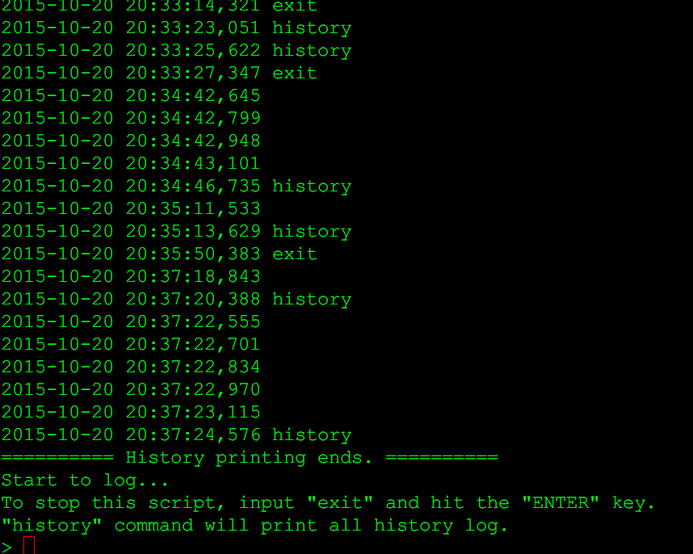

# 简易日记系统重构记录

## 1. 合并`run.py`和`main.py`的代码
之前领会错了 DAMA 说的容器的含义，因此重新将代码合并到一个py文件中。

## 2. 新增一个`history`命令
`history`命令的主要功能是在用户编写新的日记的时候，打印目前为止的所有日记内容。
主要的修改点还是在`appendHistory`函数的while循环中，增加一个判断条件，如果用户输入内容为`history`则直接调用`readHistory`方法，展示当前所有日志。效果如下：

## 3. 刷新`README.md`并打包
