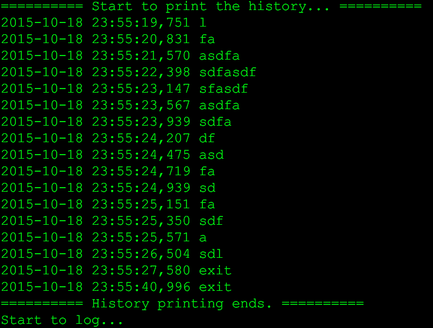
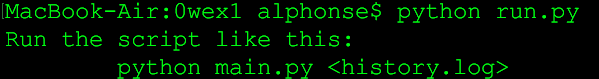
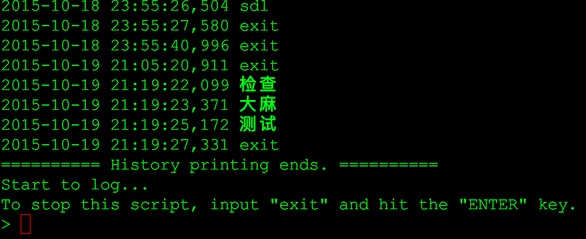

# 小小日记系统开发记录

第一周的练习草草做完，提交到页面也挺早，结果忘记把练习代码的介绍文档刷新到教程里。不知道这是不是没有拿到星星的原因。

本周练习题目公布在[芝麻星](http://www.iomooc.com/pages/login.html)，要求开发一个简易的日记系统，连夜做完，特来补充文档。题目要求如下：

> 本周整体任务概述:
> 
> * 完成一个极简交互式日记系统,需求如下:
>     * 一次接收输入一行日记
>     * 保存为本地文件
>     * 再次运行系统时,能打印出过往的所有日记
> * 时限: 0wd4~1wd3
> * 发布: 发布到各自仓库的 `_src/om2py0w/0wex1/` 目录中
> * 指标:
>     * 包含软件使用说明书: `README.md`
>     * 能令其它学员根据说明书,运行系统,完成所有功能

## 设计思路
先根据具体功能需求，分析需要完成什么功能：

> 一次接收输入一行日记

需要支持用户从键盘输入，最好的方法莫过于调用`raw_input('> ')`，函数的返回结果存入变量`input`中，等待后续处理。

> 保存为本地文件

用户输入的内容需要保存到文件中，因此涉及文件的基本操作。

> 再次运行系统时，能够打印出过往所有日记

这个功能涉及文件读取，将读取到的文件内容全部打印到屏幕。

由于觉得只是实现这几条小功能过于简陋，因此自作主张，设计增加了脚本其他功能，例如：

* 增加更多的提示信息，告诉用户当前正在打印历史信息、现在可以接受输入、如何退出脚本等
* 记录日记过程中，添加`while`死循环，保证用户在输入`exit`并回车之前，可以一直输入下去
* 因为前几天写一个解析 XML 文件的脚本工具时，用到了 Python 自带的`logging`模块，决定将写文件的操作直接交给`logging`模块来处

这是初期的运行效果：

## 第一轮迭代
没弄明白 DAMA 所说的容器是什么东东，就自作主张拆分了脚本，`run.py`作为运行入口，`main.py`作为一个module导入到其中。第一次这么玩，竟然稀里糊涂成功了。

## 第二轮迭代
使用`sys`模块的`sys.argv`获取脚本运行时传入的变量，并判断参数个数。在参数个数小于1时，打印`usage`信息：

脚本运行后，会根据给出的文件名查找历史日记所在的文件，如果文本不存在，打印提示信息；如果文件存在，读取文件内容并打印到屏幕。

## 第三轮迭代
DAMA 的要求中提到读写中文、参数中文，直接运行脚本发现功能正常不报错，暂且先通过，明天再研究编码问题。因为上周写工具解析 XML 的时候，遇到几次UnicodeError，感觉这个迭代的坑在编码问题。

## 第四轮迭代
要求做到持续交互，输入指定命令退出。但是这个功能已经在最开始的时候被我擅自主张得给做了=。=！

<B>明天我再重构一把功能好了，用户在写日记的时候可以随时敲`history`命令，查看整个日记内容</B>。

## 第五轮迭代
直接借助`logging`模块，将日记内容逐行写入文件中，每行带有对应的时间戳，而文本的换行问题也不需要关心了......