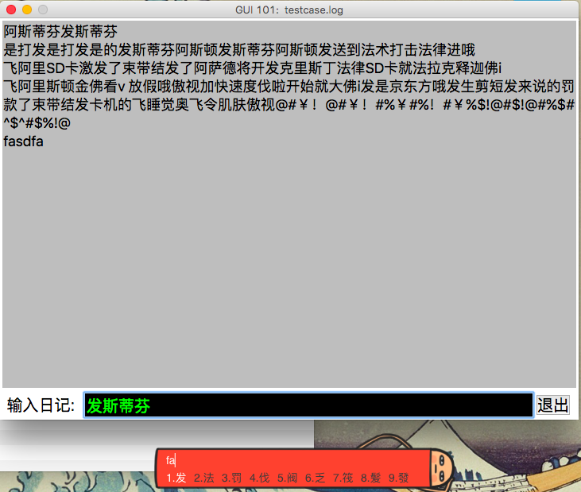

# GUI101 - 基于Tkinter的日记系统

经历各种搜索各种纠结，终于完工。

- 代码范围两部分，`main.py`和`history.py`，前者为程序入口和GUI代码，后者为文件操作。
- 脚本运行方式：`python main.py [filename]`
	- 带有`filename`参数的情况下，脚本将使用参数指定的文件作为日记文件，进行读取和写入
		+ 如果不存在则会新建
	- 没有给出`filename`参数的情况下，会默认打开一个`history.log`文件，进行去读取和写入
- 输入框支持中文字符输入，为这事儿还Google了老半天。解决方法可以参见[迭代记录](../../../0MOOC/2w/SprintLog.md)中`Entry Widget支持中文`一节
- 点击`退出`按钮后，退出脚本

运行效果：

