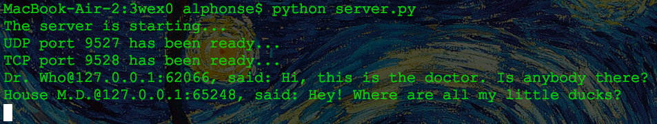
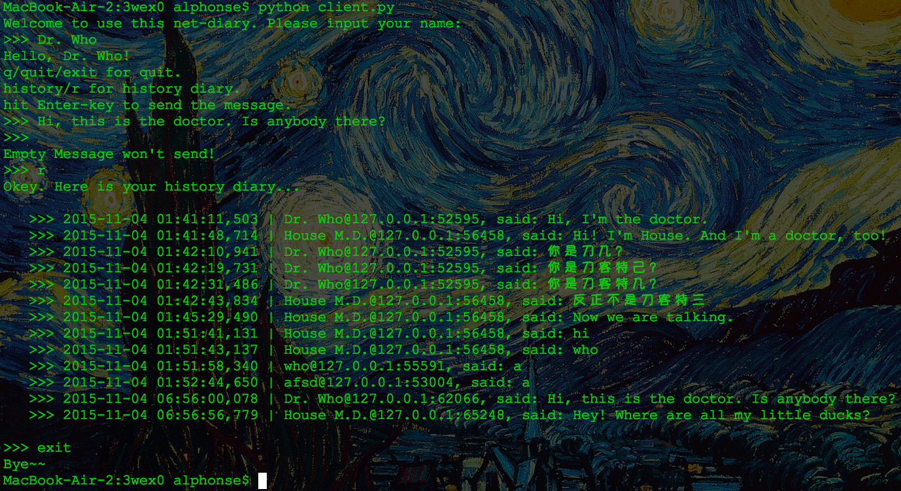

# 基于网络的日志系统
## 服务端
* `server.py`
* 监听`UDP`端口`9527`，用于接收用户消息
* 监听`TCP`端口`9528`，用于处理用户的历史消息请求
* 执行方法：
	* `python server.py`
	* 执行样例
	

	
## 客户端
* `client.py`
* 启动
	* 要求用户输入用户名
	* 待发送消息通过`UDP`端口传输，回车键发送，空消息不发送
* 请求历史消息
	* 注册用户名之后，输入`r`或`history`
* 退出
	* 注册用户名之后，输入`q`、`quit`或`exit`
* 支持同时多客户端在线发送消息
* 支持最多5个用户请求历史消息

