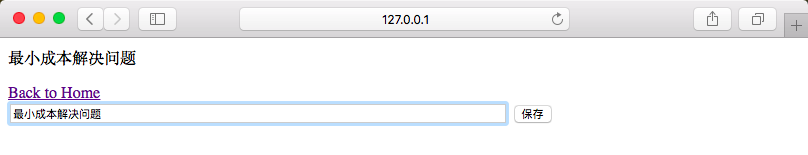

# 基于 Web 页面的日志系统

## 1. 运行Server

* 执行`python diary.py`
* 打开浏览器，访问`http://127.0.0.1:8080/`
* 根据页面提示，选择
	* 历史日志
	* 写新日志

## 2. CLI 交互
* 首先保证Server端运行
* 执行`python cli.py`
* 根据提示逐行输入日志
* 输入`q`并按下回车后，退出

